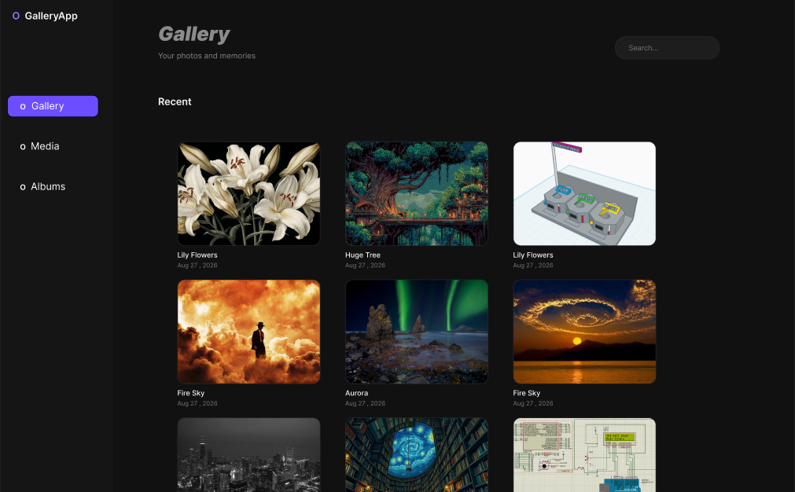
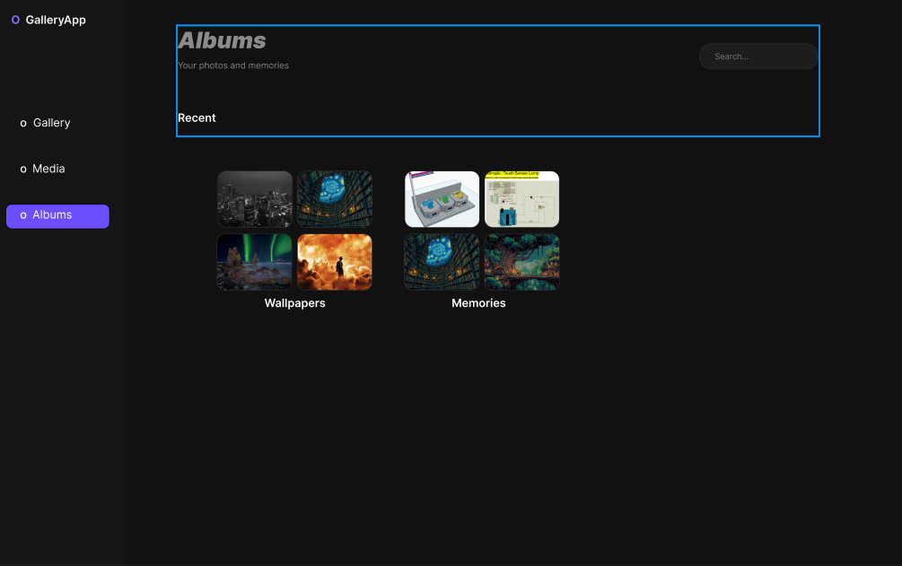
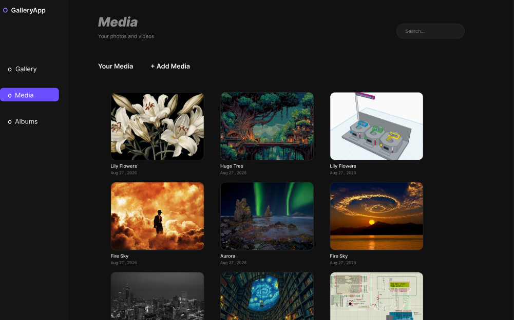
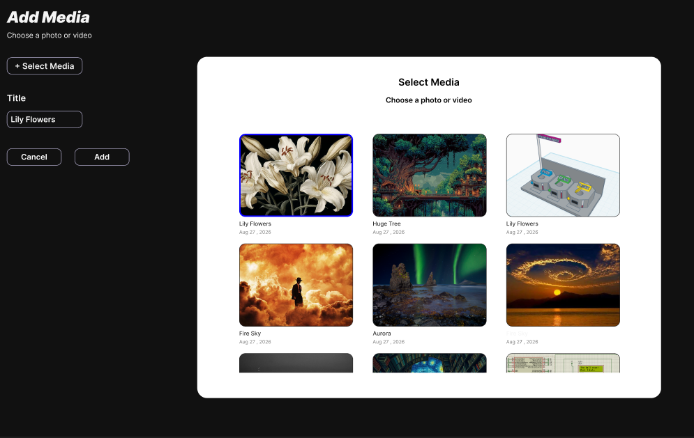
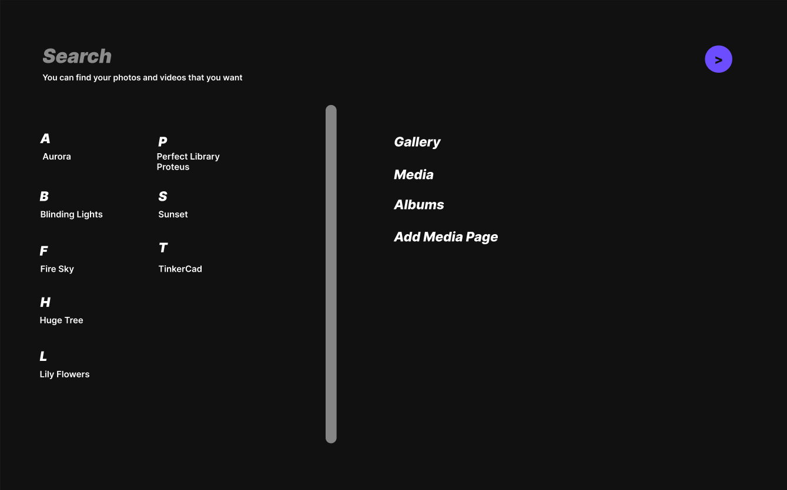

# Gallery App UI 🎨

A modern and minimal desktop Gallery App interface designed in Figma.

## 📌 About the Project

This project is a UI/UX design concept for a desktop-based Gallery App.
The interface was designed with a focus on simplicity, usability and a clean
visual experience for browsing and organizing photos.

## ✨ Features

- 🖼️ Modern photo gallery interface
- 📁 Album organization
- 🏞️ Media browsing
- 🔍 Simple and intuitive navigation
- 👁️ Photo viewing interface
- 🎨 Clean and minimal visual design
- 🖥️ Desktop application layout

## 🛠️ Design Tools

- Figma
- UI/UX Design
- Prototyping

## 📸 Screenshots

### Gallery

### Albums

### Media

### Photo View

### Search 

### Full Design

## 🔗 Figma Design

[View the Gallery App Design on Figma](https://www.figma.com/proto/JmKhn0VRC7OTGD27TPj2Du/GALLERY-APP?node-id=0-1&t=sZoOTE5f5DTqTAkg-1)

## 📂 Project Files

- `Gallery-App-UI.fig` — Complete Figma design file
- `gallery.png` — Gallery screen
- `albums.png` — Albums screen
- `media.png` — Media screen
- `photo-view.png` — Photo viewing screen
- `figma-design.png` — Overall design preview

---

Designed with Figma 🎨
